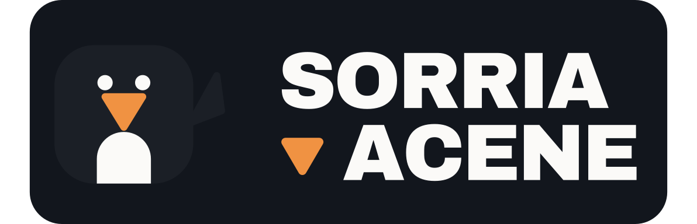

<div align="center">
  
</div>

<p align="center">
  Reconhece o alfabeto de Libras pela webcam, em tempo real e 100% no navegador.<br>
  Nenhum quadro de vídeo sai da sua máquina.
</p>

---

Você faz a letra com a mão, ela aparece na tela — e quando você **sorri** pra
confirmar, ela é falada em voz alta e entra na palavra que está sendo
soletrada.

O nome veio de um acidente. Eu precisava de um jeito de confirmar "é essa
letra mesmo" sem tirar a mão da posição. Testei confirmar com aceno de
cabeça, mas toda vez que eu acenava a mão mexia junto e estragava o
reconhecimento. Troquei por sorriso, funcionou de primeira — e a ferramenta
virou literalmente o bordão dos pinguins de Madagascar.

## Status

Projeto pessoal, em desenvolvimento. O que funciona hoje:

| | Estado |
|---|---|
| 21 letras paradas (pose) | ✅ treinado e funcionando |
| 5 letras com movimento (H, J, K, X, Z) | ⚠️ pipeline completo e testado, **falta gravar os dados** |
| Confirmação por sorriso | ✅ |
| Fala em voz alta (pt-BR) | ✅ |
| Soletrar palavras | ✅ |
| Ícones da extensão | ❌ pendente |
| Publicação na Chrome Web Store | ❌ não publicado |

A acurácia relatada pelo treino (~99%) é medida com amostras da **mesma
sessão de gravação** — mesma mão, mesma luz, mesmo dia. O desempenho real é
menor. Isso é uma limitação conhecida, não um número de marketing.

## Como funciona

```
webcam (getUserMedia)
        │  quadro
        ▼
MediaPipe HandLandmarker (WASM local)  ──►  21 pontos {x, y, z} da mão
        │
        ▼
gestureRecorder — a mão está parada ou em movimento?
        │
        ├── PARADA ──► normaliza (63 números) ──► MLP estático ──► letra + confiança
        │
        └── MOVIMENTO ──► grava a sequência até parar
                          ──► 60 características do gesto
                          ──► MLP de movimento ──► letra | NADA
        │
        ▼
letra "tentativa" na tela (só acima do limiar de confiança)
        │
        ▼
MediaPipe FaceLandmarker (blendshapes) ──► sorriu?
        │  sim
        ▼
bipe + fala (Web Speech API) + letra entra na palavra + amostra guardada
```

### Os dois tipos de letra

Esse é o fato central do projeto, e o que mais custou pra entender: **o
alfabeto de Libras não é um conjunto de poses.** H, J, K, X e Z envolvem
movimento — a mão se desloca ou gira.

Tentar reconhecê-las com um classificador que julga uma "foto" por vez não
falha silenciosamente: falha **contaminando o resto**. Durante um J, a mão
passa por formas que parecem outras letras paradas. Quando o K estava na base
estática, ele derrubava a acurácia de todas as outras letras — tirá-lo subiu
o modelo de 95% para 99%.

A solução foi separar em dois classificadores e arbitrar a cada quadro:

- **Arbitragem** (`gestureRecorder.js`): mede a velocidade do pulso em
  *tamanhos de mão por segundo* — assim o limiar vale igual com a mão perto
  ou longe da câmera. Parada → pose. Em movimento → grava até parar.
- **Pre-roll**: os ~200ms anteriores ao disparo entram na gravação, pra não
  perder o comecinho do gesto. Eles **não** contam para a duração mínima,
  senão qualquer tremida viraria um gesto válido.
- **Classe `NADA`**: levar a mão até a posição também é movimento. Em vez de
  adivinhar por regra o que é gesto e o que é transição, o classificador é
  treinado com exemplos de "mexi a mão à toa" e decide sozinho.

### Por que landmarks e não pixels

Os classificadores não olham a imagem. Eles recebem os 21 pontos 3D que o
MediaPipe já extraiu. Isso deixa o problema muito menor (63 números em vez de
uma imagem inteira), robusto a iluminação e fundo, e permite treinar um modelo
bom com poucas centenas de amostras.

**Normalização (letras paradas)**: os pontos são centralizados no pulso e
escalados pela maior distância — o modelo fica invariante a onde a mão está
no quadro e a quão perto da câmera ela está.

**Características do gesto (letras com movimento)** — 60 números:

| Característica | Nºs | Para quê |
|---|---:|---|
| Forma da mão no início | 21 | 7 pontos-chave × xyz |
| Forma da mão no fim | 21 | pega o **J**, que gira o pulso |
| Trajeto do pulso | 15 | 5 pontos relativos ao início |
| Retilineidade | 1 | separa **K** (sobe reto) de **Z** (zigue-zague) |
| Inversões de direção | 1 | **Z** tem ~2, **K** tem 0 |
| Duração | 1 | |

### O bug que não dá erro

As 60 características são calculadas **duas vezes**, em linguagens diferentes:
em Python (`movement_features.py`) para treinar, e em JavaScript
(`movementFeatures.js`) em tempo real. Se as duas implementações divergirem
num detalhe, o modelo recebe entradas diferentes das que viu no treino e passa
a errar — **sem lançar exceção nenhuma**, só piorando a acurácia em silêncio.

Por isso existe um teste de paridade: o Python gera um gesto sintético e suas
características, o JavaScript recalcula, e os dois são comparados número a
número. Hoje batem com diferença máxima de `4.4e-16` — só ruído de ponto
flutuante.

### Confirmação por sorriso

`FaceLandmarker` com `outputFaceBlendshapes: true` entrega direto um número de
0 a 1 para `mouthSmileLeft` / `mouthSmileRight` — sem nenhuma conta de
geometria. O detector exige segurar o sorriso por ~350ms (evita disparo por
uma risada rápida) e tem histerese + cooldown para não confirmar em rajada.

Escolhido no lugar do aceno de cabeça justamente porque **sorrir não mexe a
mão** que está formando a letra.

## Privacidade

Tudo roda localmente:

- Sem backend, sem servidor, sem conta, sem telemetria
- Os modelos do MediaPipe são empacotados na extensão e rodam via WASM
- Nenhum quadro de vídeo, imagem ou landmark é enviado a lugar nenhum
- `permissions: []` no manifesto — a câmera é pedida pela própria página, via
  o prompt padrão do navegador

O botão "Baixar amostras confirmadas (CSV)" gera um arquivo **local**, que só
sai da máquina se você mesmo mandar.

## Instalação

Requisitos: Node.js (só para preparar os arquivos) e Google Chrome.

```bash
cd extension
npm install
npm run vendor    # copia o MediaPipe para lib/ — o CSP do Manifest V3 não permite CDN
```

Baixe os modelos do MediaPipe (grandes demais para o git):

```bash
curl -L -o extension/lib/models/hand_landmarker.task \
  https://storage.googleapis.com/mediapipe-models/hand_landmarker/hand_landmarker/float16/1/hand_landmarker.task

curl -L -o extension/lib/models/face_landmarker.task \
  https://storage.googleapis.com/mediapipe-models/face_landmarker/face_landmarker/float16/1/face_landmarker.task
```

O de rosto é opcional: sem ele a extensão reconhece letras normalmente, só não
confirma por sorriso.

No Chrome: `chrome://extensions` → **Modo do desenvolvedor** → **Carregar sem
compactação** → selecione a pasta `extension/`.

> Rodar detecção de mão **e** rosto a cada quadro pesa mais que só mão. Em
> máquinas mais antigas pode ficar lento — é esperado.

## Treino

Sem os classificadores treinados, a extensão detecta e desenha a mão, mas não
reconhece letras. O passo a passo completo está em
[`training/README.md`](training/README.md). Resumo:

```powershell
cd training
py -3.12 -m venv .venv                                  # Python 3.10–3.12
.venv\Scripts\python.exe -m pip install -r requirements.txt

.venv\Scripts\python.exe collect_data.py                # letras paradas
.venv\Scripts\python.exe train.py

.venv\Scripts\python.exe collect_movement_data.py       # H, J, K, X, Z + NADA
.venv\Scripts\python.exe train_movement.py
```

Os modelos são exportados como **JSON puro** (pesos de uma rede pequena) para
`extension/lib/models/`, e a extensão os carrega sozinha — não precisa editar
código depois de treinar.

Há também um dataset público opcional para reforçar as letras paradas, mantido
em arquivo separado do seu (`train.py --with-external`). Detalhes e ressalvas
em [`training/README.md`](training/README.md).

## Testes

```bash
cd extension
npm test
```

Não precisam de webcam. Cobrem:

- **`gestureRecorder.test.mjs`** — a máquina de estados que separa pose de
  gesto, com sequências simuladas: mão parada, gesto normal, tremida curta,
  movimento lento, mão saindo do quadro, dois gestos seguidos.
- **`parity.test.mjs`** — a paridade Python ↔ JavaScript das características
  do gesto (ver "O bug que não dá erro"). Requer rodar antes
  `training/check_parity.py`, que gera o gesto de referência.

## Estrutura

```
extension/
  manifest.json           Manifest V3
  icons/                  o lockup da marca
  build/vendor.cjs        copia o MediaPipe de node_modules para lib/
  lib/                    MediaPipe + modelos (fora do git — ver Instalação)
  src/
    app/
      app.html/css/js     tela: câmera, leitura, alfabeto, palavra
      gestureRecorder.js  arbitragem parada × movimento
      smileDetector.js    confirmação por sorriso (blendshapes)
      sampleStore.js      amostras confirmadas + exportação CSV
      sound.js            bipe de confirmação (Web Audio, sem arquivo)
    classifier/
      classifier.js       letras paradas
      movementClassifier.js  letras com movimento
      movementFeatures.js    as 60 características  ⟷ gêmeo em Python
      mlp.js              forward pass compartilhado
    background/           abre a aba ao clicar no ícone
  test/                   testes (npm test)

training/
  collect_data.py            grava poses (rajada de 30 amostras por tecla)
  collect_movement_data.py   grava gestos (sequência completa)
  movement_features.py       as 60 características  ⟷ gêmeo em JavaScript
  train.py / train_movement.py
  export_model.py            exporta MLP do scikit-learn como JSON
  check_parity.py            gera o gesto de referência para o teste
  process_external_dataset.py

docs/roadmap.md
```

## Stack e decisões técnicas

| Decisão | Motivo |
|---|---|
| **MediaPipe Tasks Vision** (WASM, local) | detecção de mão e rosto prontas, rodando offline no navegador |
| **scikit-learn** para treinar, **JavaScript puro** para inferir | o modelo é pequeno; o forward pass cabe em ~30 linhas |
| **Sem TensorFlow.js** | o TF Python conflitava de versão com o Python 3.12, e arrastar uma biblioteca de ML inteira para o navegador não se justifica num MLP de uma camada |
| **Manifest V3** | não permite código remoto — por isso o MediaPipe é vendorizado em `lib/` |
| **Landmarks crus no CSV de gestos** | permite melhorar a extração de características sem regravar dados |
| **Sem backend** | privacidade e simplicidade; o Java entra só na Fase 2 (ver roadmap) |

## A marca

**Sorria e Acene** — referência ao bordão dos pinguins de *Madagascar*, que
virou a descrição literal das duas entradas do app: você **acena** (a mão faz
as letras) e **sorri** (para confirmar).

O selo é um pinguim geométrico: bico e nadadeira são triângulos da mesma
família, com cantos arredondados. Paleta:

| | Hex | Uso |
|---|---|---|
| Tinta | `#12161d` | fundo |
| Selo | `#1b1f26` | corpo do pinguim |
| Osso | `#fbfaf8` | peito, texto |
| Bico | `#f09242` | acento da marca |
| Rastro | `#4fd1e0` | esqueleto da mão, confiança — "a máquina te vendo" |

O arquivo vetorial está em [`extension/icons/lockup.svg`](extension/icons/lockup.svg).

## Créditos

- **[MediaPipe](https://ai.google.dev/edge/mediapipe)** (Google) —
  `HandLandmarker` e `FaceLandmarker`, sob Apache 2.0.
- **Brazilian Sign Language Alphabet Dataset** — Passos, B. T.; Fernandes,
  A. M. R.; Comunello, E. (2020), Mendeley Data, V5.
  [doi:10.17632/k4gs3bmx5k.5](http://dx.doi.org/10.17632/k4gs3bmx5k.5)

  **Ressalva importante**: esse dataset foi montado a partir de imagens de
  **ASL** (língua de sinais americana), selecionando as 15 letras cujo formato
  de mão os autores afirmam coincidir com Libras. É um trabalho acadêmico
  publicado e ajuda na robustez, mas **não substitui dado capturado com
  sinalizantes brasileiros nativos** — que é uma lacuna real da área.

## Limitações conhecidas

- **Não sou fluente em Libras.** As amostras foram gravadas por mim, conferindo
  com material de referência. Um sinalizante nativo revisando as poses é uma
  melhoria óbvia e bem-vinda.
- As 5 letras com movimento ainda não têm dados gravados.
- O modelo só viu uma mão (a minha), então tende a errar mais com mãos de
  tamanhos, tons de pele e estilos de sinalização diferentes.
- Limiares de velocidade do gesto e de sorriso foram calibrados no olho e
  provavelmente precisam de ajuste em outras câmeras. Estão como constantes
  comentadas no topo de `gestureRecorder.js` e `smileDetector.js`.

## Roadmap

Fase 2 (frases, tradução de gramática Libras → Português, áudio, e um
orquestrador em Java/Spring Boot) e Fase 3 (modelo temporal para palavras
inteiras, digitar em campos de texto de qualquer site) estão em
[`docs/roadmap.md`](docs/roadmap.md).

## Licença

MIT.
